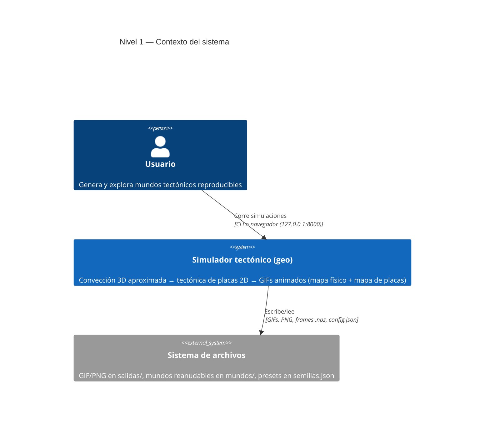
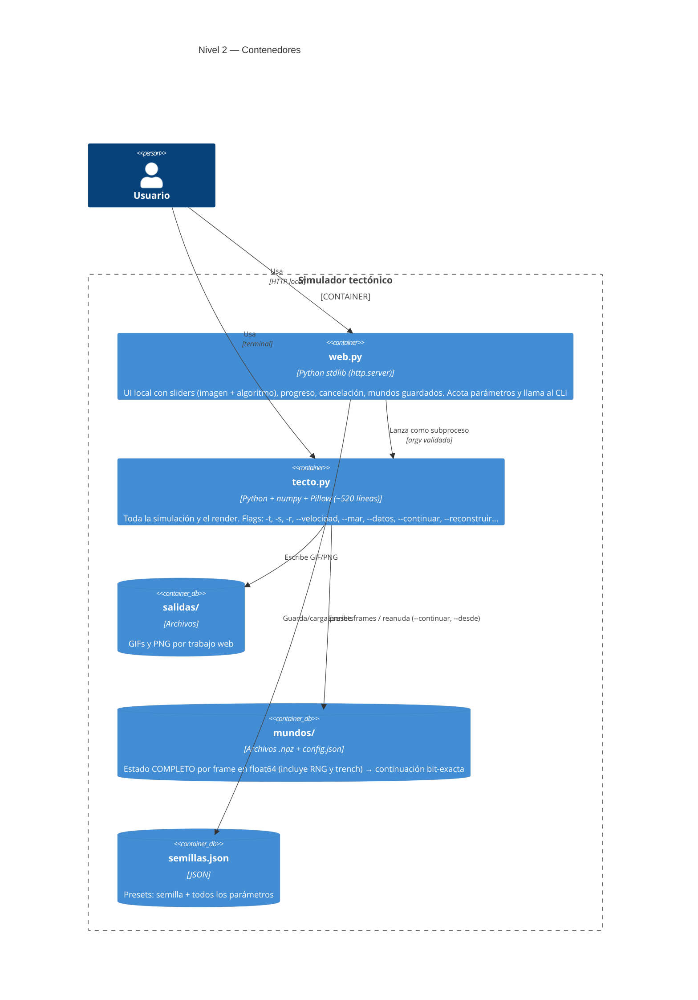
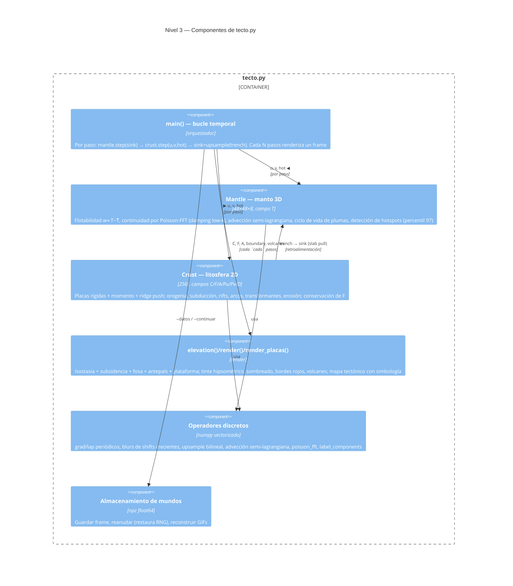

# ARQUITECTURA_C4.md — arquitectura del simulador tectónico en modelo C4

Complemento de [`ALGORITMO.md`](ALGORITMO.md) (la matemática) y del
[`README.md`](README.md) (el uso). Este documento describe el sistema en los
cuatro niveles del modelo C4 — Contexto, Contenedores, Componentes y Código —
y mapea **qué rasgo geológico se produce en qué etapa** del pipeline.
Los diagramas están en sintaxis Mermaid C4 (se renderizan en GitHub).

---

## Nivel 1 — Contexto

Un usuario genera mundos tectónicos animados, desde el navegador o desde la
terminal. El sistema no tiene dependencias externas más allá de numpy+Pillow.



---

## Nivel 2 — Contenedores

Dos procesos y tres almacenes. `web.py` nunca simula: solo valida rangos y
lanza el CLI como subproceso.



---

## Nivel 3 — Componentes de `tecto.py`

Tres capas acopladas por paso, con una retroalimentación corteza→manto
(slab pull). El bucle de `main()` orquesta:



Flujo de datos entre capas (el "diagrama de tubería" de ALGORITMO.md §1):

```
MANTO 3D (48×48×8)          LITOSFERA 2D (256²)              RENDER
Mantle.step(sink) ──u,v──▶  Crust.step(u,v,hot) ──C,F,A──▶  elevation() → render()
        ▲    └──hot──────────────┘      │
        └────────── sink = trench ◀─────┘   (slab pull)
```

---

## Nivel 4 — Código: el pipeline por paso y su geología

El orden dentro de `Crust.step()` **no es arbitrario** (ALGORITMO.md §4).
Cada fila es una etapa del pipeline en su orden real de ejecución; la columna
central dice qué rasgo geológico o proceso tectónico nace ahí.

### Etapa A — Manto (`Mantle.step`)

| # | Etapa (código) | Rasgo geológico / proceso | Ref. |
|---|---|---|---|
| A1 | Flotabilidad `w = BUOY·(T − T̄)` | **Convección del manto** — lo caliente sube, lo frío baja | §3.1 |
| A2 | Continuidad Poisson-FFT con damping low-k | **Celdas de convección → número de placas** (~2.5 celdas por lado); u,v que arrastran las placas | §3.2 |
| A3 | Advección semi-lagrangiana de T + difusión + fondo ruidoso | **Reorganización lenta del patrón convectivo** (deriva de largo plazo) | §3.3 |
| A4 | Ciclo de vida de plumas (nacen cada 70 pasos, derivan, mueren) | **Plumas del manto / superplumas**; su deriva vs. la placa produce cadenas de islas tipo **Hawái** | §3.4 |
| A5 | `T −= SLAB_PULL·sink` bajo las fosas | **Slab pull**: la losa que subduce ancla la corriente descendente y sostiene los cinturones de subducción | §3.5 |
| A6 | Detección de cabezas de pluma (percentil 97 de la columna ascendente) | **Puntos calientes (hotspots)** — el mapa `hot` que alimenta el volcanismo | §3.6 |

### Etapa B — Litosfera (`Crust.step`, en orden de ejecución)

| # | Etapa (código) | Rasgo geológico / proceso | Ref. |
|---|---|---|---|
| B1 | Balsas rígidas (etiquetado de componentes + velocidad media por placa) | **Rigidez de placa** — las placas se mueven enteras; hace posibles las **colisiones continentales** | §4.1 |
| B2 | Momento `Pu/Pv` (media móvil exponencial, τ=50 pasos) | **Inercia de rumbo de placa** — la deriva sostiene su dirección aunque el manto cambie | §4.2 |
| B3 | Ridge push `P −= RIDGE_PUSH·∇(e^{−A/AGE_TAU})` | **Empuje de dorsal** — deslizamiento gravitacional desde la dorsal; motor de la deriva post-rift (ciclo de Wilson barato) | §4.3 |
| B4 | Advección de C, F, A, Pu, Pv, D | **Deriva continental** propiamente dicha | §3.3 |
| B5 | `transform = max(shear − 2.5·|div|, 0)` | **Fallas transformantes** (tipo San Andrés) — solo un valle de falla, sin orogenia ni fosa | §4.6 |
| B6 | `dC/dt = −1.5·conv·C` donde F<0.4 | **Subducción** — solo la corteza oceánica se consume | §4.4 |
| B7 | `dC/dt = +1.8·conv·C` donde F≥0.4 | **Orogenia de colisión** continente-continente (tipo **Himalaya**); el crecimiento multiplicativo focaliza cinturones estrechos | §4.4 |
| B8 | Arco: blur de `conv·[F<0.4]` recortado por F | **Arco de subducción / cordillera costera** (tipo **Andes**), desplazada tierra adentro de la fosa | §4.5 |
| B9 | DoG de la carga orogénica, solo render | **Cuenca de antepaís** (foreland basin) — foso flexural que se inunda como mar interior | §4.7 |
| B10 | Rift `dC/dt = −1.2·opening·(C−C_OCEAN)` + desgarre de F con umbral 0.006 | **Rifting y ruptura continental** (tipo **Rift de África Oriental** → apertura de océano) | §4.8 |
| B11 | Anti-difusión biestable + renormalización de F + piso de flotabilidad | **Flotabilidad continental** — los continentes se parten y deforman pero no desaparecen; costas nítidas | §4.9 |
| B12 | Edad A: envejece advectada, renace SOLO en el eje divergente | **Dorsales meso-oceánicas** y **cuencas abisales viejas**; la subsidencia térmica da el perfil dorsal→abisal | §4.10 |
| B13 | `trench = conv·[F<0.4]` | **Fosas de subducción** (tipo **Marianas/Perú-Chile**); también es el `sink` del slab pull | §4.11 |
| B14 | Hotspots sobre océano con techo logístico C≤0.9 | **Islas volcánicas y cadenas de punto caliente** (tipo **Hawái**) | §4.12 |
| B15 | Fosa difuminada × halo (excluye el núcleo) sobre océano | **Arcos de islas** intraoceánicos (tipo **Marianas**) | §4.12 |
| B16 | `volcano_arc`, `volcano_hot` | **Volcanes activos** (puntos rojos: máximos locales de actividad) | §4.12 |
| B17 | Detalle fractal advectado D (τ=10 pasos) | **Rugosidad del terreno / costas irregulares** (solo render) | §4.14 |
| B18 | Erosión asimétrica (picos pierden 35%, valles reciben 100%) | **Erosión con rebote isostático** — por eso las cordilleras viejas persisten (tipo **Apalaches**) | §4.13 |
| B19 | `boundary = (|div|+shear)·(atenuado sobre plumas)` | **Límites de placa** (el trazo rojo del mapa) | §4.15 |

### Etapa C — Render (`elevation` → `render` / `render_placas`)

| # | Etapa (código) | Rasgo geológico / visual | Ref. |
|---|---|---|---|
| C1 | `elev ∝ C − SEA_LEVEL`, cuadrática en tierra | **Isostasia** — llanuras verdes anchas, solo las colisiones llegan a nieve | §5.1 |
| C2 | `elev −= SUBSIDENCE·(1−e^{−A/AGE_TAU})` | **Subsidencia térmica del fondo oceánico** (profundidad ∝ edad) | §4.10 |
| C3 | Halo de F remapeado casi-binario | **Plataforma continental** con talud abrupto; los márgenes activos la pierden bajo la fosa | §5.1 |
| C4 | `elev −= TRENCH·trench`, `elev −= 14·foreland` | Batimetría de **fosa** y **mar interior de antepaís** (solo render, invariante 11) | §5.1 |
| C5 | Tinte hipsométrico + sombreado NW + bordes rojos + volcanes | El **mapa físico** (GIF principal) | §5.2 |
| C6 | `render_placas`: dorsal (ámbar), rift (naranja), fosa (violeta), cordilleras (marrón), flechas de deriva | El **mapa tectónico**: la simbología sale de los MISMOS campos que la física | §5.3 |

---

## Retroalimentaciones (lo que hace al sistema un ciclo y no una tubería)

1. **Slab pull** (B13 → A5): la fosa enfría el manto bajo ella → refuerza la
   corriente descendente → más convergencia → más fosa. Estabilizado por
   `DECAY` y la difusión.
2. **Ridge push** (B12 → B3): la edad `A` es la única memoria de dónde
   estuvo cada dorsal; su gradiente empuja las placas pendiente abajo,
   amplificado ×50 vía el momento.
3. **Momento** (B2 → B4): la velocidad que advecta la corteza es el manto
   filtrado paso-bajo a 50 pasos, no el instantáneo.

## Invariantes arquitectónicos (resumen; lista completa en ALGORITMO.md §7)

- Damping low-k en `poisson_fft` (sin él: supercontinente único).
- `F` se conserva por renormalización multiplicativa.
- Reetiquetar placas **cada** paso; el océano lleva velocidad local, no cero.
- Blurs siempre con shifts crecientes (1,2,3…), nunca stride fijo.
- Umbrales relativos (percentiles), no absolutos, para hotspots y bordes.
- Fosa y antepaís viven en el render, no en `C`.
- Estado de reanudación en float64 e incluye `trench` y el estado del RNG.
